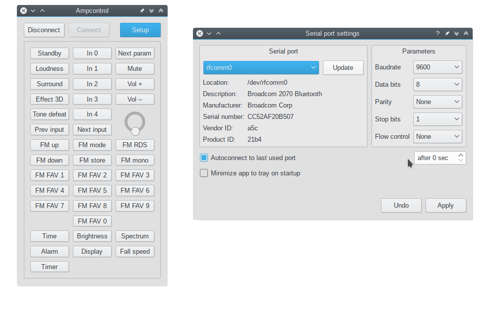

# Project overview

This system is an amplifier control module supporting various audio processors with I²C interface. It can be managed either with RC-5, RC-6, NEC or Samsung infrared remote control or with front panel 5 buttons and rotary encoder. All appropriate information during control is displayed on monochrome graphic LCD. When nothing is controlled, current time, FM radio screen or results of signal spectrum analisis are displayed.

<iframe width="640" height="360" src="https://www.youtube.com/embed/i6dqi8C9fBk" style="border: 0;" allowfullscreen></iframe>

Upstream development is focused on [ATmega32](https://github.com/WiseLord/ampcontrol/tree/m32) MCU and 128x64 graphic displays (KS0108 and ST7920 controllers). This version provides many features, possibly missing in other possible hardware options. Alphanumeric displays with size 16x2, which based on HD44780 (KS0066) controllers are also now supported, but they don't look so cute as graphic displays. ATmega328p (base of many Arduino boards) instead of ATmega32 can be also used, but due to limited pins number it supports only graphic displays 128x64.

Also, [ATmega16](https://github.com/WiseLord/ampcontrol/tree/m16) version can be used. The schematic is similar, but only KS0108 and KS0066 displays are supported. Because of smaller Flash size the set of suupported features is lower.

Also, [ATmega8](https://github.com/WiseLord/ampcontrol/tree/m8) version is under active development. But it doesn't include some features from main branch and supports only alphanumeric displays. Also, ATmega328p can be used with the same schematics.

# Main features:

|Feature                                                                 |ATmega32|ATmega328|ATmega16|ATmega8|
|------------------------------------------------------------------------|--------|---------|--------|-------|
|Amplifier control (mute/standby external signals)                       |yes     |yes      |yes     |yes    |
|Digital audio control (feature set depends on used audio processor)     |yes     |yes      |yes     |yes    |
|32-band spectrum analyzer (0..5kHz)                                     |yes     |yes      |yes     |yes    |
|English, Russian, Belarusian, Ukrainian and possible other localizations|yes     |yes      |yes     |yes    |
|FM radio support                                                        |yes     |yes      |yes     |yes    |
|Up to 50 FM stations can be saved in EEPROM                             |yes     |yes      |yes     |yes    |
|10 favourite FM stations support (mapped to 0..9 buttons of remote)     |yes     |yes      |yes     |yes    |
|RC5 remote control support                                              |yes     |yes      |yes     |yes    |
|RC6, NEC, Samsung remotes support                                       |yes     |yes      |-       |-      |
|Learning mode for remote control                                        |yes     |yes      |-       |-      |
|Nice graphics (icons) on graphic LCDs                                   |yes     |yes      |-       |-      |
|Nice graphics (fonts) on graphic LCDs                                   |yes     |yes      |yes     |-      |
|Alarm support (per day of week)                                         |yes     |yes      |-       |-      |
|Standby timer (adjustable from 2 minutes to 5 hours)                    |yes     |yes      |-       |-      |
|No-signal standby timer                                                 |yes     |yes      |-       |-      |
|Sound level meter, various modes of spectrum analyzer look'n'feel       |yes     |yes      |-       |-      |

# Supported audio processors:

|Audioprocessor|Feature set                                                                    |ATmega32|ATmega328|ATmega16|ATmega8|
|--------------|-------------------------------------------------------------------------------|--------|---------|--------|-------|
|TDA7439       |4 stereo inputs, bass, middle, treble                                          |yes     |yes      |yes     |yes    |
|TDA7312       |4 stereo inputs, bass, treble                                                  |yes     |yes      |yes     |yes    |
|TDA7313/PT2313|3 stereo inputs, bass, treble, fade, loudness                                  |yes     |yes      |yes     |yes    |
|TDA7314       |Stereo input, bass, treble, fade, loudness                                     |yes     |yes      |yes     |yes    |
|TDA7315       |Stereo input, bass, treble                                                     |yes     |yes      |yes     |yes    |
|TDA7318       |4 stereo inputs, bass, treble, fade                                            |yes     |yes      |yes     |yes    |
|PT2314        |4 stereo inputs, bass, treble, loudness                                        |yes     |yes      |yes     |yes    |
|TDA7448       |6-ch input, fade, center, subwoofer                                            |yes     |yes      |yes     |yes    |
|PT2323/PT2322 |4 stereo inputs, 5.1 input, bass, treble, fade, center, subwoofer, surround, 3d|yes     |yes      |yes     |yes    |
|TEA6300       |3 stereo inputs, bass, treble, fade                                            |yes     |yes      |yes     |yes    |
|TEA6330       |Stereo input, bass, treble, fade                                               |yes     |yes      |yes     |yes    |
|PGA2310       |High-end stereo volume control                                                 |yes     |-        |yes     |yes    |
|TUNER_VOLUME  |Use built-in tuner (RDA580x/Si4703) volume control as audioprocessor           |yes     |yes      |yes     |yes    |
|R2S15904SP    |4 stereo inputs, bass, treble (found in Microlab Solo-7C)                      |yes     |-        |yes     |yes    |

# Supported displays:

|Display      |Description                                                                |ATmega32|ATmega328|ATmega16|ATmega8|
|-------------|---------------------------------------------------------------------------|--------|---------|--------|-------|
|KS0108 type A|Monochrome 128x64 graphic display with direct CS1/CS2 polarity             |yes     |yes      |yes     |-      |
|KS0108 type B|Monochrome 128x64 graphic display with inverted CS1/CS2 polarity           |yes     |yes      |yes     |-      |
|ST7920       |Monochrome 128x64 graphic display                                          |yes     |yes      |-       |-      |
|SSD1306      |Monochrome 128x64 graphic OLED I²C (SCK - PA4, SDA - PA2)                  |yes     |yes      |-       |-      |
|KS0066 16x2  |Monochrome alphanumeric display                                            |yes     |-        |yes     |yes    |
|LS020        |Color 176x132 graphic display found in some Siemence mobile phones like S65|yes     |-        |-       |-      |

# Schematics

* ATmega32:
    * [KS0108 type A](https://raw.githubusercontent.com/WiseLord/ampcontrol/m32/files/sch/ks0108a.png)
    * [KS0108 type B](https://raw.githubusercontent.com/WiseLord/ampcontrol/m32/files/sch/ks0108b.png)
    * [ST7920](https://raw.githubusercontent.com/WiseLord/ampcontrol/m32/files/sch/st7920.png)
    * [KS0066 16x2](https://raw.githubusercontent.com/WiseLord/ampcontrol/m32/files/sch/ks0066.png)
    * [LS020](https://raw.githubusercontent.com/WiseLord/ampcontrol/m32/files/sch/ls020.png)
    * SSD1306 SDA/SCL => PA4/PA2 (DISP_STROB and DISP_DATA of parallel displays)
* ATmega328:
    * [KS0108 type A](https://raw.githubusercontent.com/WiseLord/ampcontrol/m32/files/sch/m328-ks0108a.png)
    * For KS0108B and ST7920 schematics is similar
    * SSD1306 SDA/SCL => PC0/PC1 (DISP_STROB and DISP_DATA of parallel displays)
* ATmega16:
    * [KS0108 type A](https://raw.githubusercontent.com/WiseLord/ampcontrol/m16/files/sch/ampcontrol_gd_a.png)
    * [KS0108 type B](https://raw.githubusercontent.com/WiseLord/ampcontrol/m16/files/sch/ampcontrol_gd_b.png)
    * [KS0066 16x2](https://raw.githubusercontent.com/WiseLord/ampcontrol/m16/files/sch/ampcontrol_lcd.png)
* ATmega8:
    * [KS0066 16x2](https://raw.githubusercontent.com/WiseLord/ampcontrol/m16/files/sch-m8.png)

# Supported FM tuners

|Tuner     |Description                                   |ATmega32|ATmega328|ATmega16|ATmega8|
|----------|----------------------------------------------|--------|---------|--------|-------|
|TEA5767   |I²C FM tuner                                  |yes     |yes      |yes     |yes    |
|RDA5807   |I²C FM tuner with RDS support                 |yes     |yes      |yes     |yes    |
|TUX032    |I²C FM tuner found in some Sony car radio     |yes     |yes      |yes     |yes    |
|LM7001    |SPI-control frequency synthesizer             |yes     |-        |yes     |yes    |
|RDA5802   |I²C FM tuner                                  |yes     |yes      |yes     |yes    |
|SI470X    |I²C FM tuner with RDS support                 |yes     |yes      |yes     |yes    |
|LC72131   |SPI-control frequency synthesizer             |yes     |-        |yes     |yes    |

# Ampcontrol EEPROM editor

While project uses various parameters from EEPROM memory (for example, audioprocessor and tuner selection), special desktop application to edit eeprom_xx.bin was designed. It allows to load, modify and save eeprom binary file in easy way.

Ampcontrol editor application has different versions for ATmega32/328 and ATmega8. 

Ampcontrol editor is written with Qt5 and it's sources (for ATmega32/328) are availiable at [Github](https://github.com/WiseLord/ampcontrol/tree/m32/editor). For ATmega16 and ATmega8 [another](https://github.com/WiseLord/ampcontrol/tree/m8/editor) version should be used because of different eeprom size and layout.

# Ampcontrol remote control application

Ampcontrol remote can be used to control the device (ATmega32/328 only) from PC. It works via any UART. TX pin of UART should be connected to RX pin of MCU. An appropriate COM port settings have to be set up.

Also, if you have Bluetooth adapter that provides COM port in the system, it also can be used to control the device without any wires. Bun on the device side Bluetooth-to-UART bridge should be used. HC-05 (or HC-06) module is the best choice for it. In this case Android version of application can also be used.

Remote application is also written with Qt5 and it's sources can be get from [Github](https://github.com/WiseLord/ampcontrol/tree/m32/remote).

# Other hardware options:

* [Atmega8-lcd](https://github.com/WiseLord/ampcontrol/tree/m8-lcd) branch

    This branch is hardcoded to be used with 16x2 character display, TDA7313 audio processors and it doesn't support FM radio. But it's interface localization can be switched between Russian and English without EEPROM reflashing, and also it supports RC5 learning mode. Both m8 and m8-lcd branches has the same pinout.

# Useful links

* [Releases](https://github.com/WiseLord/ampcontrol/releases) of Ampcontrol firmwares and related software.
* [Dropbox](https://www.dropbox.com/sh/v46ib0gwmx4y2cm/AADzyizRaCVh8Zkf52P10qSTa?dl=0) folder with recent 'beta' builds
* [Youtube playlist](https://www.youtube.com/watch?v=yy9XiIlWfCc&list=PLfv57leyFFd3KTFyBgsR7_01ZDTgWIuI9) (mostly in Russian) about Ampcontrol
* [First article about the project](http://radiokot.ru/circuit/audio/other/39) (in Russian)
* [Second article about the project](href="http://radiokot.ru/circuit/audio/other/45) (in Russian)
* [Forum thread](http://radiokot.ru/forum/viewtopic.php?t=98758) (in Russian)
